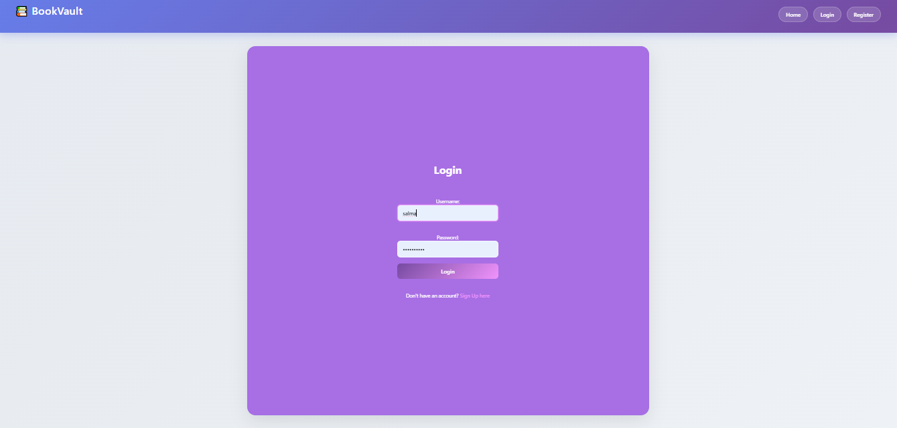
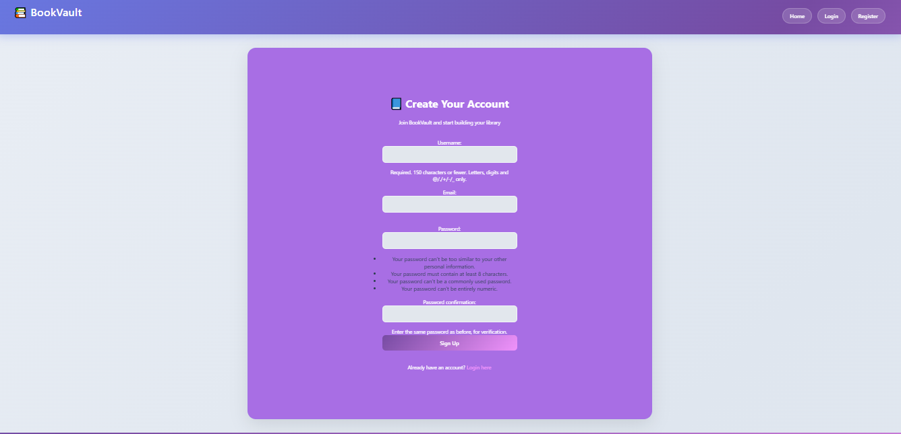
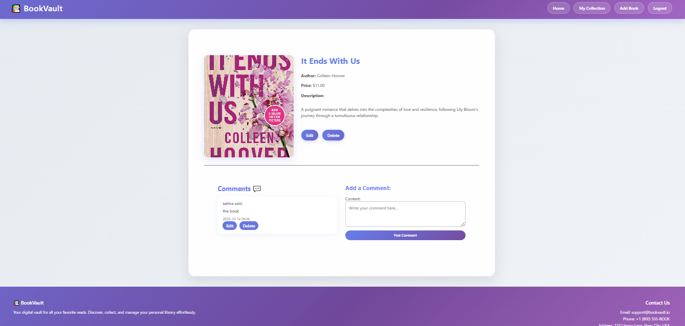
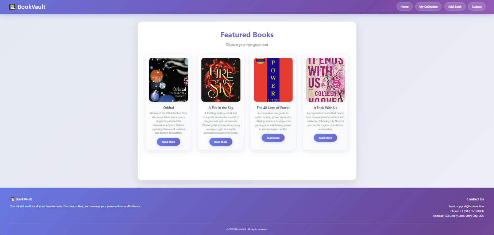
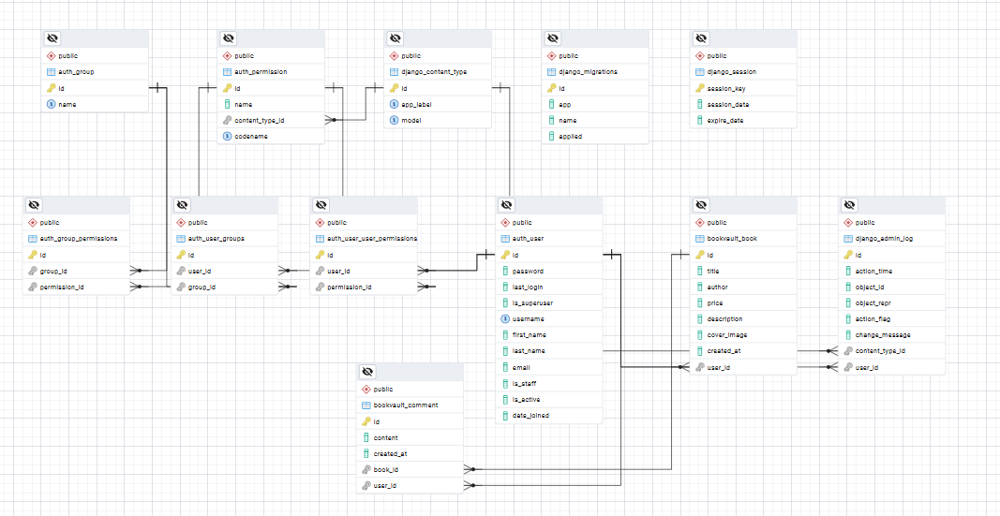

# 📚 BookVault – Personal Book Collection App  

## ✨ The Story Behind the Project  
It all started with a simple idea — as book lovers, we often struggle to keep track of the books we own, want to read, or have already finished.  
**BookVault** was created to solve this problem — a digital bookshelf that helps you organize your personal book collection easily and beautifully.  

The goal of this project is to provide a **simple, secure, and visually appealing platform** where users can:  
- Manage their entire book collection in one place.  
- Upload book covers for a more visual experience.  
- Share opinions through comments.  
- Enjoy a smooth and responsive interface across all devices.  

---

## 🖼️ Key Features (with Visuals)  

### 🔐 User Authentication  
A secure system for registration and login using Django’s built-in authentication system.  

### 📘 Book Management  
Add new books, edit existing ones, or remove them anytime — full CRUD functionality for each book.  
 

### 💬 Book Comments  
Users can add comments on individual book pages to share their thoughts and discuss with others.  

### 🖼️ Visual Library  
Each book includes a cover image, turning your digital library into a real bookshelf.  

### 📱 Responsive Design  
The interface is fully responsive and works beautifully on desktop, tablet, and mobile.  

---

## 💻 Technology & Tools Used  

| Category | Technology |
|-----------|-------------|
| **Backend** | Django 5.x (Python) |
| **Frontend** | HTML & CSS (custom responsive design) |
| **Database** | PostgreSQL |
| **Authentication** | Django’s built-in user authentication |
| **Version Control** | Git & GitHub |

---

## 🧩 Database Relationships  

Below is the Entity Relationship Diagram (ERD) used in **BookVault**:  

**Main Relationships:**  
- One user can add many books.  
- Each book belongs to one user.  
- Each book can have multiple comments.  
- Each comment is linked to both a book and a user.  

---

## 🚀 Future Improvements  

To make **BookVault** even better, I plan to:  
- Add a **search and filtering system** for books by title or author.  
- Include **categories and genres** for better organization.  
- Allow **book ratings and favorites**.  
- Implement a **dark mode** for better accessibility.  
- Add **pagination** for large book collections.  
- Improve the **comment system** with replies and like features.  

---

## 🧑‍💻 Author  
Developed with ❤️ by **Salma Omer**  
